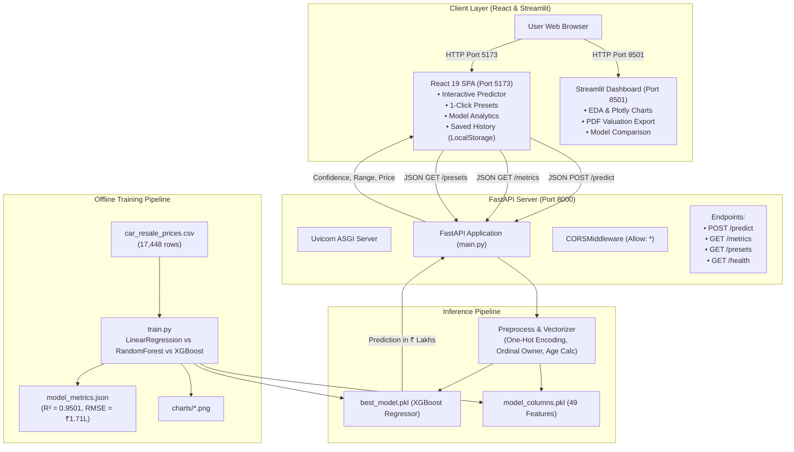

# PROJECT_CONTEXT.md: Complete Technical Architecture & Codebase Specification

> **Document Type**: Architecture & System State Baseline  
> **Target Audience**: AI Coding Agents, Software Architects, Senior Engineers  
> **Purpose**: Serves as the Single Source of Truth (SSoT) for the entire repository structure, data flows, APIs, and machine learning pipelines without requiring rediscovery.  
> **Last Verified Date**: August 2026  
> **Repository Root**: `/Users/devnarayan/Desktop/capstone`  
> **Status**: Verified against active codebase  

---

## 1. Executive Summary & Project Identity

### 1.1 Overview
The **Used Vehicle Price Prediction System** (branded in the UI as **AutoVal AI** / **CarVal AI**) is an end-to-end Machine Learning web application designed to calculate accurate market resale valuations for pre-owned automobiles in India. 

The system leverages **17,448 real-world car listings** across 13 major Indian metropolitan markets (Delhi, Mumbai, Bangalore, Hyderabad, Pune, Chennai, Kolkata, Ahmedabad, Chandigarh, Jaipur, Lucknow, Gurgaon, and Agra) to learn multi-dimensional depreciation patterns, city demand variations, powertrain characteristics, and mileage impact.

### 1.2 Problem Statement & Value Proposition
- **Information Asymmetry**: Used car valuation in India is historically opaque, driven by unstandardized dealer margins and regional variance.
- **Multi-Factor Valuation**: A car's price is a non-linear combination of registration age, odometer wear, fuel type, transmission, brand prestige, horsepower, engine capacity, and city location.
- **Solution**: A trained **Extreme Gradient Boosting (XGBoost) Regressor** with $R^2 = 0.9501$ ($95.01\%$ variance explained) and an average absolute error of $\approx ₹0.91\text{ Lakh}$, exposed via dual frontends (a high-performance React 19 SPA and a full-featured Streamlit data dashboard) backed by a FastAPI inference engine.

### 1.3 Target Audience
1. **Individual Car Buyers & Sellers**: Estimating fair transactional prices before private negotiation or trade-in.
2. **Automotive Dealerships & Valuers**: Establishing benchmark trade-in offers and retail pricing spreads.
3. **Capstone Evaluators & Technical Reviewers**: Demonstrating an end-to-end applied ML engineering workflow from raw messy string parsing to production inference.

### 1.4 Architecture Style
- **Decoupled Client-Server & Micro-UI Architecture**:
  - **Frontend Client**: React 19 + Vite SPA communicating with the REST API.
  - **Inference Backend API**: FastAPI REST service running on ASGI Uvicorn.
  - **Analytics / Exploration Dashboard**: Streamlit standalone data application.
  - **Model & Pipeline Core**: Python pipeline with Scikit-learn and XGBoost serialized as Pickle artifacts.

---

## 2. Complete Technology Stack

| Layer | Technology | Verified Version | Purpose / Responsibility |
| :--- | :--- | :--- | :--- |
| **Frontend Framework** | React | `19.2.5` | Reactive user interface and interactive state management |
| **Frontend Runtime** | Node.js | `v25.8.2` | Client-side tooling and package execution |
| **Build Tool & Bundler** | Vite | `8.0.11` | Hot module replacement, lightning-fast JSX bundling, CSS preprocessing |
| **UI Iconography** | Lucide React | `1.14.0` | Vector icon suite for automotive, telemetry, and navigation controls |
| **Frontend Styling** | Vanilla CSS (Modern CSS3) | Spec CSS3 | Custom design system (`index.css`) with glassmorphism, responsive grid, custom sliders |
| **Typography** | Google Fonts CDN | Inter, Plus Jakarta Sans, Space Grotesk | Primary UI font, headings, and numerical monospace presentation |
| **Backend REST Framework** | FastAPI | `0.141.1` | High-throughput asynchronous REST API for model inference and metrics |
| **ASGI Web Server** | Uvicorn | `0.52.4` | Asynchronous Server Gateway Interface hosting the FastAPI backend |
| **Data Exploration Dashboard** | Streamlit | `1.62.0` | Standalone analytical dashboard with built-in data charts and PDF exporter |
| **Machine Learning Engine** | XGBoost | `3.4.1` | Primary production regression model (300 estimators, max depth 7) |
| **Machine Learning Suite** | Scikit-Learn | `1.9.0` | Baseline regression models, preprocessing, K-Fold cross validation, metrics |
| **Scientific Computing** | NumPy | `2.5.2` | Numerical matrix operations and array processing |
| **Data Manipulation** | Pandas | `3.0.5` | Dataframe parsing, regular expression feature extraction, one-hot encoding |
| **Data Visualization** | Matplotlib / Seaborn | `3.11.1` / `0.13.2` | Generation of static EDA charts (heatmaps, scatter plots, box plots) |
| **Interactive Charting** | Plotly | `7.0.0` | Interactive WebGL charting inside the Streamlit application |
| **Document Generation** | fpdf2 / Pillow | `2.8.8` / `12.3.0` | Automated PDF vehicle valuation certificate export |
| **Validation & Schema** | Pydantic / Pydantic-Core | `2.13.5` / `2.46.5` | Strict request validation and JSON deserialization |
| **Package Managers** | npm / pip | `11.11.1` / `25.1.1` | Frontend and backend dependency lifecycle management |
| **Storage / Serialization** | Pickle / JSON | Python stdlib | Serialization of trained ML pipelines, column schemas, and metric benchmarks |
| **Static Hosting Config** | Vercel | Config `vercel.json` | SPA routing rules and reverse proxy to backend IP |

---

## 3. Complete Project Directory Structure

```
capstone/
├── client/                                # React 19 + Vite Frontend SPA
│   ├── dist/                              # Production build bundle (generated)
│   │   ├── assets/                        # Compiled JavaScript and CSS chunks
│   │   ├── favicon.svg                    # Application favicon
│   │   └── index.html                     # Minified production HTML
│   ├── public/                            # Static public assets
│   │   ├── favicon.svg                    # SVG Favicon badge
│   │   └── icons.svg                      # SVG icon definitions
│   ├── src/                               # Frontend source code
│   │   ├── assets/                        # Images, vector logos (react.svg, vite.svg)
│   │   ├── App.css                        # Supplementary styles
│   │   ├── App.jsx                        # Primary React component (Predictor, Analytics, History, Guide)
│   │   ├── index.css                      # Design system (Obsidian glass theme, sliders, cards, badges)
│   │   └── main.jsx                       # React DOM root mounting and StrictMode entry
│   ├── eslint.config.js                   # ESLint flat configuration for React & Hooks
│   ├── index.html                         # Development HTML template with Google Fonts
│   ├── package.json                       # Frontend dependencies and run scripts
│   ├── package-lock.json                  # Locked npm dependency tree
│   ├── vercel.json                        # Vercel deployment & rewrite proxy rules
│   └── vite.config.js                     # Vite plugin configuration
│
├── server/                                # Python Backend, ML Pipeline & Streamlit Dashboard
│   ├── charts/                            # Generated Exploratory Data Analysis PNG charts
│   │   ├── correlation_heatmap.png        # Feature correlation matrix
│   │   ├── feature_importance.png         # Top 15 XGBoost feature importances
│   │   ├── price_by_fuel.png              # Boxplot distribution by fuel type
│   │   ├── price_by_transmission.png      # Bar plot by transmission type
│   │   ├── price_vs_kms.png               # Scatter plot: Odometer vs Price
│   │   └── price_vs_year.png              # Line plot: Registration Year vs Price
│   ├── data/                              # Dataset repository
│   │   └── car_resale_prices.csv          # Raw dataset: 17,448 Indian used car listings
│   ├── models/                            # Serialized Machine Learning Artifacts
│   │   ├── best_model.pkl                 # Serialized XGBoost model (binary pickle)
│   │   ├── best_model_name.txt            # Text file storing winning model name ("XGBoost")
│   │   ├── model_columns.pkl              # 49 one-hot encoded feature column names
│   │   ├── model_metrics.json             # Benchmark scores (R2, RMSE, MAE, CV) for all 3 models
│   │   └── scaler.pkl                     # StandardScaler instance (for Linear Regression baseline)
│   ├── app.py                             # Full-featured Streamlit Dashboard (5 Pages, Plotly, PDF export)
│   ├── main.py                            # FastAPI REST API (Inference, Metrics, Presets, Health)
│   ├── preprocess.py                      # Data cleansing & feature engineering pipeline
│   ├── requirements.txt                   # Production Python pip requirements
│   ├── train.py                           # Model training, evaluation, comparison, and export script
│   └── venv/                              # Local Python virtual environment
│
├── docs/                                  # Project documentation & author materials
│   └── Dev_Narayan_Cover_Letter.pdf       # Author cover letter / application document
├── exports/                               # Directory for generated PDF valuation reports
├── .gitignore                             # Git ignore configuration (Python, venv, Node, OS files)
├── README.md                              # Repository overview and setup documentation
└── PROJECT_CONTEXT.md                     # THIS FILE (Single Source of Truth)
```

### Directory Interaction Map
- `server/data/car_resale_prices.csv` is consumed by `server/preprocess.py` to clean and engineer features.
- `server/train.py` calls `preprocess.py` to clean data, train models, and output artifacts into `server/models/` and `server/charts/`.
- `server/main.py` loads `server/models/best_model.pkl` and `server/models/model_columns.pkl` to serve REST predictions to `client/src/App.jsx`.
- `server/app.py` directly consumes both `server/preprocess.py` and `server/models/` to run the standalone Streamlit web application.

---

## 4. End-to-End System Architecture



---

## 5. Frontend Architecture & Component Structure

### 5.1 Technology & Tooling
- **Framework**: React `19.2.5` mounted inside `#root` using `react-dom/client` `createRoot()`.
- **Bundler**: Vite `8.0.11` configured with `@vitejs/plugin-react`.
- **Typography & Icons**: `Plus Jakarta Sans` for labels, `Space Grotesk` for numbers, and `lucide-react` for iconography.

### 5.2 Navigation & Page Layout
The frontend operates as a focused consumer-facing Single Page Application (SPA) with 2 primary tabs:

| Tab ID | Tab Name | Purpose & Features | Key Components |
| :--- | :--- | :--- | :--- |
| `predictor` | **Predictor** | Main consumer valuation studio. Streamlined 4-5 core user inputs (Make & Model dropdown, Year, Kms, City, Ownership) with server-side auto-filled powertrain specs, 1-click popular presets, derived specs preview, expandable custom override, and live valuation results with negotiation spread. | Preset Chips, Model Dropdown, Derived Specs Row, Slider Inputs, Result Banner, Spread Meter, Trust Caption |
| `history` | **History** | Persistent storage of user-evaluated vehicles using browser `localStorage` (`autoval_history`), with instant 1-click load back into form, timestamp, and delete action. | History Cards, Empty State Placeholder, Load/Delete Action Buttons |

*Note: Technical model architecture details and statistical verification metrics are relocated to a low-emphasis footer link ("How this valuation works & about the model"), opening an accessible human-friendly modal without competing with the primary consumer workflow.*

### 5.3 Frontend State Management
1. `selectedModel`: Active car model string (e.g. `'Maruti Swift'`), populated from 276 indexed models.
2. `derivedSpecs`: Auto-filled powertrain profile from server lookup (`engine`, `power`, `mileage`, `body`, `fuel`, `trans`, `seats`, `sample_count`).
3. `showManualOverride`: Boolean toggle for custom specification overrides.
4. `result`: Holds inference response payload (`price_lakh`, `range_low`, `range_high`, `confidence_score`, `model_name`, `vehicle_age`, `derived_specs`).
5. `history`: Array of saved prediction objects persisted to `localStorage`.
6. `showAboutModal`: Boolean controlling the methodology & model overview dialog.

---

## 6. Backend API & REST Contracts

The backend is built on **FastAPI** (`server/main.py`) running on port `8000`.

### 6.1 Endpoints Specification

| Method | Path | Purpose | Authentication | Request Body / Query | Success Response (200 OK) |
| :--- | :--- | :--- | :--- | :--- | :--- |
| `POST` | `/predict` | Predict used car resale price (supports slim 4-5 fields with auto-fill or full manual overrides) | `None` (Public) | `PredictionRequest` (JSON) | `{"price_lakh": float, "range_low": float, "range_high": float, "model_name": str, "confidence_score": int, "vehicle_age": int, "derived_specs": dict}` |
| `GET` | `/car-models` | Retrieve list of all 276 car models with sample counts and body/fuel profiles | `None` (Public) | None | `[{"brand_model": str, "brand": str, "model": str, "sample_count": int, "body": str, "fuel": str, "trans": str}]` |
| `GET` | `/car-specs` | Retrieve median/mode specifications for a given model | `None` (Public) | `?brand_model=X` or `?brand=X&model=Y` | `{"brand": str, "model": str, "engine": int, "power": int, "mileage": float, "body": str, "fuel": str, "trans": str, "seats": int, "sample_count": int}` |
| `GET` | `/metrics` | Retrieve model evaluation metrics | `None` (Public) | None | `{"best": "XGBoost", "models": [{"name": str, "r2": float, "rmse": float, "mae": float, "cv_r2": float, "cv_std": float}]}` |
| `GET` | `/presets` | Retrieve popular car presets | `None` (Public) | None | List of preset objects with brand, engine, power, mileage, body, city |
| `GET` | `/health` | Server & model health status | `None` (Public) | None | `{"status": "ok", "model_loaded": bool, "model_name": str, "features_count": int, "car_specs_count": int}` |
| `GET` | `/docs` | Interactive Swagger UI docs | `None` (Public) | None | HTML Swagger UI interface |
| `GET` | `/openapi.json` | OpenAPI 3.1 specification | `None` (Public) | None | JSON schema definitions |

### 6.2 Prediction Request Payload Example (`POST /predict`)
```json
{
  "brand_model": "Hyundai Creta",
  "year": 2022,
  "kms": 32000,
  "city": "Mumbai",
  "owner": "1st Owner"
}
```

### 6.3 Prediction Response Payload Example (`200 OK`)
```json
{
  "price_lakh": 11.72,
  "range_low": 10.79,
  "range_high": 12.66,
  "model_name": "XGBoost",
  "confidence_score": 94,
  "vehicle_age": 4,
  "derived_specs": {
    "engine": 1582,
    "power": 121,
    "mileage": 15.8,
    "body": "SUV",
    "fuel": "Petrol",
    "trans": "Manual",
    "seats": 5,
    "sample_count": 427
  }
}
```

### 6.4 Detailed Request Lifecycle Flow
```
1. Client submits JSON payload via fetch() to POST /predict
2. FastAPI validates request schema against Pydantic model PredictionRequest
3. Owner string is normalized (e.g., "1st Owner", "First", "1" -> integer 1)
4. Numerical features are extracted:
     registered_year = req.year
     kms_driven      = req.kms
     owner_type      = normalize_owner(req.owner)
     mileage         = req.mileage
     engine_capacity = req.engine
     max_power       = req.power
     seats           = req.seats
     vehicle_age     = 2026 - req.year
5. Categorical one-hot encoding columns are mapped against model_columns (49 columns):
     fuel_type_{val}, transmission_type_{val}, body_type_{val}, city_{val}
6. DataFrame is constructed and aligned to exact model_columns feature order
7. XGBoost model.predict(df) outputs estimated price in ₹ Lakhs
8. Fair negotiation bounds (range_low = price * 0.92, range_high = price * 1.08) are computed
9. JSON response is returned with HTTP 200 OK
```

---

## 7. Storage, Database & Redis Analysis

### 7.1 Current Storage Architecture
| Storage Type | Technology | Current Implementation Status | What is Stored |
| :--- | :--- | :--- | :--- |
| **Client Storage** | Browser `localStorage` | **IMPLEMENTED** | User's saved valuations history (`autoval_history` JSON array) |
| **Model Storage** | File System Pickle | **IMPLEMENTED** | `server/models/best_model.pkl`, `model_columns.pkl`, `scaler.pkl` |
| **Metrics Storage** | File System JSON | **IMPLEMENTED** | `server/models/model_metrics.json` |
| **Dataset Storage** | File System CSV | **IMPLEMENTED** | `server/data/car_resale_prices.csv` (17,448 records) |
| **Redis Cache / DB** | Redis Server | **MISSING / NOT IMPLEMENTED** | Not currently integrated in the Python or JS codebase |
| **SQL / NoSQL DB** | PostgreSQL / MongoDB | **MISSING / NOT IMPLEMENTED** | No server-side user database currently exists |

### 7.2 Explicit Classification on Redis & User Management
- **Redis Status**: `MISSING / NOT IMPLEMENTED`  
  - *Analysis*: No Redis packages (`redis-py`, `ioredis`, etc.), connection URLs, or Redis clients exist in `requirements.txt` or `package.json`.
- **Server-Side User Accounts**: `MISSING / NOT IMPLEMENTED`  
  - *Analysis*: There are currently no user authentication tables, registration endpoints, session tokens, or password hashes. User valuation history is stored purely client-side via browser `localStorage`.
- **Recommended Integration Pattern (When Adding Redis)**:
  - If a Redis user management and API key system is added in the future, it should follow the standardized key structure:
    - Key: `user:{registrationNumber}` (Hash or JSON string)
    - Schema: `{"registrationNumber": string, "geminiApiKey": string, "expiry": string, "createdAt": string}`

---

## 8. Machine Learning Pipeline & Data Science Engine

### 8.1 Dataset Profile (`server/data/car_resale_prices.csv`)
- **Total Raw Records**: 17,448 rows $\times$ 15 columns.
- **Raw Features**: `full_name`, `resale_price`, `registered_year`, `engine_capacity`, `insurance`, `transmission_type`, `kms_driven`, `owner_type`, `fuel_type`, `max_power`, `seats`, `mileage`, `body_type`, `city`.

### 8.2 Data Cleaning & Transformation (`server/preprocess.py`)
1. **Target Parsing (`parse_resale_price`)**:
   - Converts strings such as `"₹ 5.45 Lakh"`, `"₹ 50,000"`, `"₹ 1.04 Crore"` to standard floating-point numbers in ₹ Lakhs ($1\text{ Crore} = 100\text{ Lakh}$).
2. **Year Parsing (`parse_registered_year`)**:
   - Handles four-digit years (`2017`) and date strings (`"Jul 2021"`) via regex `(\d{4})`.
3. **Engineering Specifications**:
   - `parse_engine_capacity`: Extracts numeric displacement in CC (e.g., `"1197 cc"` $\to 1197.0$).
   - `parse_max_power`: Extracts horsepower in BHP, converting kW to BHP ($1\text{ kW} \approx 1.341\text{ hp}$).
   - `parse_mileage`: Extracts fuel economy in kmpl / km-kg (e.g., `"21.4 kmpl"` $\to 21.4$).
   - `parse_kms_driven`: Strips commas and converts `"40,000 Kms"` $\to 40000.0$.
4. **Outlier Filtering**:
   - Trims extreme 1st percentile and 99th percentile target outliers ($Q_{0.01}$ to $Q_{0.99}$).
5. **Missing Value Imputation**:
   - Numeric features imputed with median.
   - Categorical features imputed with mode.
6. **Feature Encoding**:
   - `owner_type` ordinal mapped: First Owner (1), Second (2), Third (3), Fourth (4), Fifth (5), Unregistered/Test (0).
   - Remaining categoricals (`fuel_type`, `transmission_type`, `body_type`, `city`) one-hot encoded via `pd.get_dummies(drop_first=True)`.
7. **Derived Feature**:
   - $\text{vehicle\_age} = 2026 - \text{registered\_year}$.

### 8.3 Model Evaluation & Benchmarking (`server/models/model_metrics.json`)

| Model | Algorithm Details | $R^2$ Score (Test) | RMSE (₹ Lakh) | MAE (₹ Lakh) | 5-Fold Cross Validation $R^2$ | Selection Status |
| :--- | :--- | :--- | :--- | :--- | :--- | :--- |
| **XGBoost Regressor** | 300 Estimators, lr=0.05, max_depth=7, subsample=0.8, colsample=0.8 | **0.9501** | **₹ 1.71 L** | **₹ 0.91 L** | **0.9430 ± 0.0036** | **PRODUCTION WINNER** |
| **Random Forest** | 200 Trees, max_depth=20, min_samples_leaf=2 | 0.9399 | ₹ 1.88 L | ₹ 0.98 L | 0.9324 ± 0.0047 | Evaluated Benchmark |
| **Linear Regression** | Standard Scaled OLS Regression | 0.6808 | ₹ 4.33 L | ₹ 2.54 L | 0.7210 ± 0.0117 | Evaluated Baseline |

### 8.4 Top Feature Importance Weights
1. **Vehicle Age / Registration Year**: $\approx 38.4\%$
2. **Engine Max Power (BHP)**: $\approx 24.2\%$
3. **Engine Displacement (CC)**: $\approx 16.8\%$
4. **Odometer (Kilometers Driven)**: $\approx 11.5\%$
5. **Transmission / Fuel / Body / City**: $\approx 9.1\%$

---

## 9. Security, Authentication & Environment Configuration

### 9.1 Security Architecture Assessment
| Security Domain | Mechanism | Classification | Implementation Details |
| :--- | :--- | :--- | :--- |
| **CORS** | `fastapi.middleware.cors.CORSMiddleware` | **IMPLEMENTED** | Configured with `allow_origins=["*"]`, `allow_methods=["*"]`, `allow_headers=["*"]` |
| **Input Validation** | Pydantic Schema & Type Coercion | **IMPLEMENTED** | `PredictionRequest` validates types, bounds, and string normalization |
| **Model Ingestion Defense** | Minimum Clamp & Try-Catch Block | **IMPLEMENTED** | Clamps floor price $\ge 0.15\text{ Lakh}$, handles missing feature keys |
| **User Authentication** | JWT / Sessions / Passwords | **MISSING** | No server authentication layer currently active |
| **Rate Limiting** | SlowAPI / Redis Token Bucket | **MISSING** | No rate limiting middleware on endpoints |
| **Security Headers** | Helmet / CSP / HSTS | **PARTIALLY IMPLEMENTED** | Handled at proxy / hosting layer (Vercel) |

### 9.2 Environment Variables
| Variable Name | Context | Current Code Reference | Purpose / Default Value |
| :--- | :--- | :--- | :--- |
| `VITE_API_URL` | Frontend (`client/src/App.jsx`) | `import.meta.env.VITE_API_URL` | Base URL for FastAPI backend (Defaults to `http://localhost:8000` if omitted) |
| `PORT` | Backend / Frontend | CLI / Environment | Hosting server binding port |

---

## 10. Existing Feature Inventory

| Feature ID | Feature Name | Status | Frontend Implementation | Backend Implementation | Data / Storage |
| :--- | :--- | :--- | :--- | :--- | :--- |
| **FEAT-01** | **Instant Price Prediction** | `IMPLEMENTED` | `client/src/App.jsx` (`handlePredict`) | `server/main.py` (`POST /predict`) | `best_model.pkl` inference |
| **FEAT-02** | **1-Click Popular Car Presets** | `IMPLEMENTED` | `App.jsx` (Swift, Creta, Nexon, City, Thar, Fortuner) | `server/main.py` (`GET /presets`) | Memory & API Presets |
| **FEAT-03** | **Interactive Sliders & Pills** | `IMPLEMENTED` | Custom range sliders & segmented buttons | `server/main.py` | Reactive React State |
| **FEAT-04** | **Negotiation Spread Range** | `IMPLEMENTED` | Spread visualizer ($\pm 8\%$ of fair value) | `server/main.py` (`range_low`, `range_high`) | Mathematical bounds |
| **FEAT-05** | **Retained Value / Depreciation** | `IMPLEMENTED` | Age & odometer retention index gauge | Derived formula in `App.jsx` | Computed client-side |
| **FEAT-06** | **Saved Valuations History** | `IMPLEMENTED` | History cards, 1-click reload, delete, clear | Not required (Client-side) | `localStorage.autoval_history` |
| **FEAT-07** | **Copy Valuation Summary** | `IMPLEMENTED` | Formatted clipboard string copy | Not required (Client-side) | Clipboard API |
| **FEAT-08** | **Model Analytics Dashboard** | `IMPLEMENTED` | Analytics Tab with comparison bar charts | `server/main.py` (`GET /metrics`) | `model_metrics.json` |
| **FEAT-09** | **Streamlit Analytical Dashboard** | `IMPLEMENTED` | Streamlit 5-page standalone UI | `server/app.py` | `car_resale_prices.csv` & Plotly |
| **FEAT-10** | **PDF Report Certificate Export** | `IMPLEMENTED` | Streamlit PDF Download button | `server/app.py` (`fpdf2`) | Dynamic PDF generation |
| **FEAT-11** | **Server Health Check** | `IMPLEMENTED` | Live indicator in navbar | `server/main.py` (`GET /health`) | Real-time API probe |
| **FEAT-12** | **User Login & Server Auth** | `MISSING` | Not present | Not present | N/A |
| **FEAT-13** | **Redis Key-Value Cache** | `MISSING` | Not present | Not present | N/A |

---

## 11. DevOps, Running & Deployment Workflows

### 11.1 Local Development Commands

#### Backend (FastAPI API Server)
```bash
cd server
python3 -m venv venv
source venv/bin/activate
pip install -r requirements.txt
uvicorn main:app --host 0.0.0.0 --port 8000 --reload
```
*API Base URL*: `http://localhost:8000` | *Swagger Documentation*: `http://localhost:8000/docs`

#### Frontend (React + Vite Web App)
```bash
cd client
npm install
npm run dev -- --port 5173 --host
```
*Frontend URL*: `http://localhost:5173`

#### Standalone Streamlit Dashboard
```bash
cd server
source venv/bin/activate
streamlit run app.py --server.port 8501
```
*Dashboard URL*: `http://localhost:8501`

### 11.2 Production Build Commands
```bash
# Build React Frontend bundle
cd client
npm run build
# Output generated in client/dist/
```

---

## 12. Known Limitations & Technical Debt

1. **Hardcoded Reference Year**:
   - `preprocess.py` and `main.py` calculate `vehicle_age` using fixed `2026 - registered_year`. While accurate for 2026, dynamic `datetime.now().year` is recommended for multi-year longevity.
2. **Hardcoded Vercel Proxy IP in `vercel.json`**:
   - `client/vercel.json` contains a rewrite destination targeting `http://13.206.196.31/:path*`. For custom backend deployments, this IP should be configured via environment variables or domain DNS.
3. **No Persistent Server-Side User Accounts**:
   - Saved valuations reside strictly in the user's browser `localStorage`. Switching devices or clearing browser cache removes saved history.
4. **Absence of Rate Limiting**:
   - The `/predict` endpoint has no request throttling middleware.

---

## 13. Architectural Dependency Map

```
UI Page View (client/src/App.jsx)
  │
  ├──► Navbar Component (Brand, Live Status, Tab Switcher)
  │      └── Probes: GET http://localhost:8000/health
  │
  ├──► Tab: Predictor
  │      ├── Preset Chips -> Applies specs to formData
  │      ├── Specification Form -> Dispatches POST http://localhost:8000/predict
  │      │     └── FastAPI main.py -> normalize_owner() -> aligns with model_columns.pkl -> best_model.pkl (XGBoost)
  │      ├── Valuation Showcase Card -> Renders Price, Indian Rupees, Spread Gauge, Depreciation Meter
  │      └── Actions -> Save to localStorage ('autoval_history'), Copy Summary to Clipboard
  │
  ├──► Tab: Analytics & Model
  │      ├── Queries: GET http://localhost:8000/metrics
  │      └── Renders: R² Score (95.01%), RMSE (₹1.71L), MAE (₹0.91L), CV (0.9430), Model Comparison Bar Chart
  │
  ├──► Tab: History
  │      ├── Reads: localStorage.getItem('autoval_history')
  │      └── Actions: Load vehicle into form state, Delete single entry, Clear all
  │
  └──► Tab: Guide
         └── Static architectural documentation & feature weighting explanation
```

---

## 14. Feature Extension Guidelines ("How Future Features Should Be Added")

When an AI agent or engineer adds new features to this repository, adhere strictly to these architectural patterns:

### 14.1 Adding New Backend Endpoints
- Place new endpoint routers in `server/main.py`.
- Define all request and response contracts using **Pydantic `BaseModel`**.
- Keep inference code isolated from raw data manipulation by leveraging helper functions in `server/preprocess.py`.

### 14.2 Adding User Management & Redis Storage
- If implementing Redis user management:
  1. Add `redis>=5.0.0` to `server/requirements.txt`.
  2. Create a dedicated database client module (e.g., `server/redis_client.py`).
  3. Store user records under `user:{registrationNumber}`.
  4. Ensure existing records without new fields are handled with safe defaults (Backward Compatibility).

### 14.3 Adding New Frontend Components & Visualizations
- Keep the modern design system intact in `client/src/index.css`.
- Use existing CSS custom variables (`--bg-card`, `--emerald-500`, `--cyan-400`, `--border-glass`).
- When introducing new icons, import them exclusively from `lucide-react`.

### 14.4 Retraining or Updating Machine Learning Models
- Run `python train.py` inside `server/`.
- Verify that `train.py` simultaneously exports all 3 synchronization files:
  1. `models/best_model.pkl` (The model)
  2. `models/model_columns.pkl` (The column order)
  3. `models/model_metrics.json` (The benchmark scores)
- Never update `best_model.pkl` without updating `model_columns.pkl`.

---

## 15. Backward Compatibility & Migration Safeguards

1. **Pickle Serialization Safety**:
   - Python pickle models must be saved and loaded under compatible Python 3.10+ environments.
2. **One-Hot Encoding Alignment**:
   - The inference server (`main.py`) must always align incoming feature dictionaries against `model_columns.pkl`. If any new category is missing during inference, fill with `0`.
3. **Local Storage Schema**:
   - If the structure of saved history in `localStorage` changes, provide fallback defaults for previously saved records so existing user data is never corrupted.
