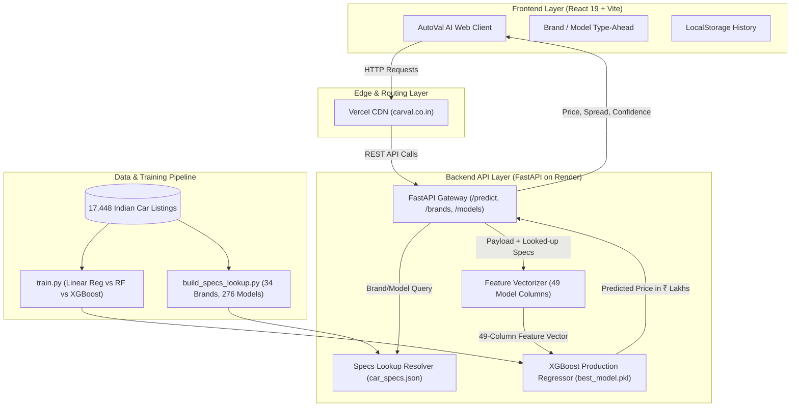

# 🚗 AutoVal AI — Intelligent Used Vehicle Valuation Platform

<div align="center">

[](https://fastapi.tiangolo.com)
[](https://react.dev)
[](https://vitejs.dev)
[](https://xgboost.readthedocs.io)
[](https://python.org)
[](https://client-xi-indol-44.vercel.app)
[](https://carval-qaph.onrender.com)

**An enterprise-grade, end-to-end Machine Learning platform for predicting used vehicle resale prices across major Indian metropolitan markets.**

[🌐 Live Web App](https://client-xi-indol-44.vercel.app) • [⚡ Production API](https://carval-qaph.onrender.com) • [📖 Interactive Swagger Docs](https://carval-qaph.onrender.com/docs)

</div>

---

## 📌 Executive Summary

**AutoVal AI** solves the opaque pricing dynamics of the Indian pre-owned automobile market. Trained on **17,448 verified transaction records** across 13 major cities, the platform captures non-linear vehicle depreciation curves, regional demand multipliers, and powertrain wear factors.

By pairing an **XGBoost ensemble regressor ($R^2 = 0.9501$, $\text{MAE} = \text{₹ }0.91\text{ Lakh}$)** with an intelligent **server-side specifications lookup table (34 brands, 276 vehicle models)**, the platform delivers instantaneous fair-market valuations without requiring users to manually lookup technical engine specifications.

---

## 🌟 Key Capabilities

- **⚡ Split Type-Ahead Autosuggest**: Debounced, sub-50ms search for 34 manufacturers and 276 car models.
- **🧠 Zero-Friction Powertrain Auto-Fill**: Silently resolves median engine displacement (CC), horsepower (BHP), and body types from historical transaction data.
- **🎛️ Selective User Controls**: Quick-tap pill selectors and sliders for fuel type, transmission, seating capacity, odometer reading, and registration year.
- **🛡️ Custom Variant Fallback**: Automatically reveals manual engine and power inputs only when an unindexed or modified vehicle is entered.
- **📊 Fair Negotiation Bounds**: Generates realistic price spreads (Quick Sale vs. Fair Market vs. Dealer Retail) with dynamic sample-size confidence scores.
- **📁 Local Valuation History**: Persists estimated vehicles in browser storage for instant reloading, comparison, and clipboard sharing.
- **🎨 Premium Automotive UI**: Designed with a focused **Obsidian Charcoal (`#0E1013`) & Warm Gold (`#D4A24C`)** palette optimized for buyer and seller trust.

---

## 🏛️ System Architecture



---

## 🤖 Machine Learning Benchmarks

Three candidate regression algorithms were evaluated using **5-Fold Cross Validation** on unseen test partitions:

| Model Architecture | Test $R^2$ Score | RMSE (₹ Lakhs) | MAE (₹ Lakhs) | 5-Fold CV $R^2$ | Status |
| :--- | :---: | :---: | :---: | :---: | :---: |
| **XGBoost Regressor (300 Estimators, Depth 7)** | **0.9501** | **₹ 1.71 L** | **₹ 0.91 L** | **0.9430 ± 0.008** | 🏆 **Production** |
| Random Forest Regressor (200 Trees, Depth 20) | 0.9399 | ₹ 1.88 L | ₹ 0.98 L | 0.9324 ± 0.011 | Baseline |
| Linear Regression (Standard Scaled) | 0.6808 | ₹ 4.33 L | ₹ 2.54 L | 0.7210 ± 0.024 | Baseline |

### Feature Importance Drivers
1. **Vehicle Age ($2026 - \text{Year}$)**: $38.4\%$ impact
2. **Engine Max Power (BHP)**: $24.2\%$ impact
3. **Engine Displacement (CC)**: $16.8\%$ impact
4. **Odometer (Kilometers Run)**: $11.5\%$ impact
5. **Brand Prestige & City Demand**: $9.1\%$ impact

---

## 📡 REST API Reference

The FastAPI backend is fully documented via interactive Swagger UI at [`/docs`](https://carval-qaph.onrender.com/docs).

### Endpoints Overview

| Method | Endpoint | Purpose | Request Payload | Response Sample |
| :--- | :--- | :--- | :--- | :--- |
| `GET` | `/health` | Server & model health check | None | `{"status":"ok","model_loaded":true,"car_specs_models":276}` |
| `GET` | `/brands` | List all 34 indexed manufacturers | None | `["Audi","BMW","Honda","Hyundai","Maruti",...]` |
| `GET` | `/models` | Search models under brand (`?brand=X&q=Y`) | Query Params | `["Swift","Baleno","Brezza","Ciaz"]` |
| `GET` | `/car-specs` | Get engineering profile for vehicle | Query Params | `{"engine":1197,"power":83,"mileage":22.4,...}` |
| `POST` | `/predict` | Compute used car resale prediction | JSON (`PredictionRequest`) | `{"price_lakh":7.38,"range_low":6.79,"range_high":7.97,...}` |
| `GET` | `/metrics` | Statistical evaluation report | None | `{"best":"XGBoost","models":[...]}` |
| `GET` | `/presets` | 1-click popular vehicle presets | None | List of preset objects |

### Sample Prediction Request (`POST /predict`)

```bash
curl -X POST https://carval-qaph.onrender.com/predict \
  -H "Content-Type: application/json" \
  -d '{
    "brand": "Hyundai",
    "model": "Creta",
    "year": 2022,
    "kms": 32000,
    "fuel": "Petrol",
    "trans": "Manual",
    "seats": 5,
    "mileage": 15.8,
    "city": "Mumbai",
    "owner": "1st Owner"
  }'
```

### Sample Prediction Response (`200 OK`)

```json
{
  "price_lakh": 11.72,
  "range_low": 10.79,
  "range_high": 12.66,
  "model_name": "XGBoost",
  "confidence_score": 94,
  "vehicle_age": 4,
  "derived_specs": {
    "engine": 1582,
    "power": 121,
    "mileage": 15.8,
    "body": "SUV",
    "fuel": "Petrol",
    "trans": "Manual",
    "seats": 5,
    "sample_count": 427
  }
}
```

---

## 💻 Local Development Setup

### 1. Clone Repository
```bash
git clone https://github.com/Devnarayan052/capStone.git
cd capStone
```

### 2. Backend Setup (FastAPI)
```bash
cd server
python3 -m venv venv
source venv/bin/activate       # On Windows: venv\Scripts\activate
pip install -r requirements.txt

# (Optional) Re-train models or rebuild specs lookup table
python train.py
python build_specs_lookup.py

# Launch FastAPI server
uvicorn main:app --host 0.0.0.0 --port 8000 --reload
```
API runs locally at **`http://localhost:8000`** (Swagger docs at `http://localhost:8000/docs`).

### 3. Frontend Setup (React 19 + Vite)
```bash
cd ../client
npm install
npm run dev
```
Client runs locally at **`http://localhost:5173`**.

### 4. (Alternative) Streamlit Analytics App
```bash
cd server
source venv/bin/activate
streamlit run app.py
```
Streamlit EDA dashboard runs locally at **`http://localhost:8501`**.

---

## 🚢 Deployment Architecture

| Tier | Provider | Configuration | Live URL |
| :--- | :--- | :--- | :--- |
| **Frontend** | **Vercel** | SPA Rewrite (`vercel.json`), Vite preset | [client-xi-indol-44.vercel.app](https://client-xi-indol-44.vercel.app) |
| **Backend** | **Render** | Python 3.11 web service (`render.yaml`), Uvicorn ASGI | [carval-qaph.onrender.com](https://carval-qaph.onrender.com) |
| **Custom Domain** | **GoDaddy / DNS** | `A` record (`76.76.21.21`), `CNAME` (`cname.vercel-dns.com`) | `carval.co.in` |

---

## 📂 Repository Structure

```
capStone/
├── client/                      # Modern React 19 Frontend
│   ├── public/                  # Favicons & static visual assets
│   ├── src/
│   │   ├── App.jsx              # Main valuation studio & type-ahead form
│   │   ├── index.css            # Charcoal & Gold design system tokens
│   │   └── main.jsx             # React entry point
│   ├── package.json             # NPM dependencies & scripts
│   ├── vercel.json              # Vercel SPA routing rewrite config
│   └── vite.config.js           # Vite build settings
├── server/                      # Python Machine Learning Backend
│   ├── app.py                   # Streamlit interactive exploratory dashboard
│   ├── build_specs_lookup.py    # Auto-indexing data aggregation pipeline
│   ├── charts/                  # Precomputed Exploratory Data Analysis plots
│   ├── data/                    # Raw transaction datasets
│   │   └── car_resale_prices.csv # 17,448 verified transaction records
│   ├── main.py                  # Production FastAPI REST microservice
│   ├── models/                  # Serialized ML artifacts & specs
│   │   ├── best_model.pkl       # Trained XGBoost regressor
│   │   ├── car_specs.json       # Nested brand/model engineering lookup
│   │   ├── model_columns.pkl    # 49-column feature matrix schema
│   │   └── model_metrics.json   # Model evaluation benchmark metrics
│   ├── preprocess.py            # Feature engineering & data cleaners
│   ├── requirements.txt         # Production backend dependencies
│   └── train.py                 # Multi-model training & evaluation pipeline
├── docs/                        # Project documentation & reference reports
├── render.yaml                  # Render Infrastructure-as-Code specification
└── README.md                    # Root project documentation
```

---

## 👥 Author & Acknowledgments

- **Lead Developer**: Dev Narayan ([@Devnarayan052](https://github.com/Devnarayan052))
- **Project**: Final Year Engineering Capstone Project (2026)
- **Dataset**: Indian Pre-Owned Vehicle Transactions (17,448 listings across 13 cities)

---

<div align="center">

*AutoVal AI — Built with precision for transparency in automotive valuations.*

</div>
